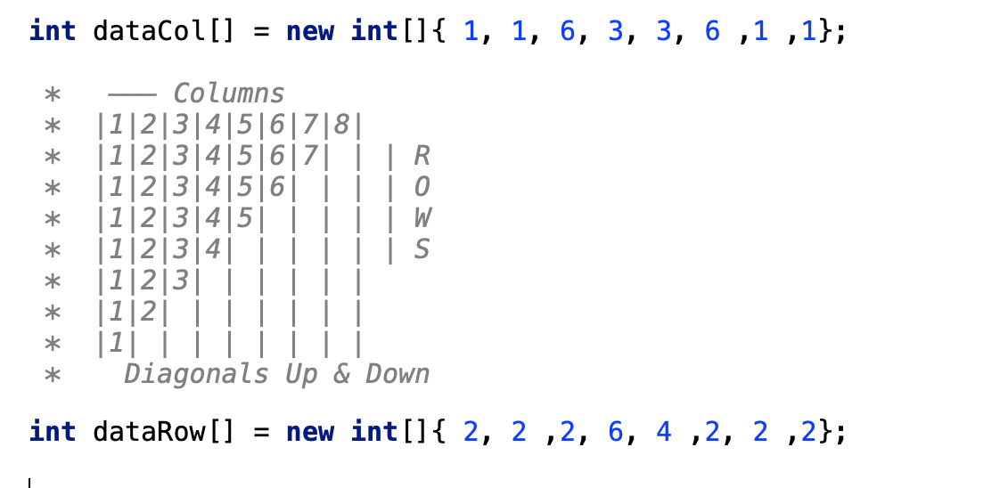

# constraint-programming
constraint programming using choco 
Imagine we do not have an image probably we lost it or we compressed and we want our AI system to restore it just by using its signature .
Here some here comes programming by constraints in which we give our initial conditions and domain of our variables and let the solver to figure out what is the solution 
In this example we input to out program a signature in form of arrays
Each array represents a particular signature , one for Rows one For Columns and one for Diagonals 

